# 🏗️ Flight Booking System - Frontend Architecture

## System Architecture Overview

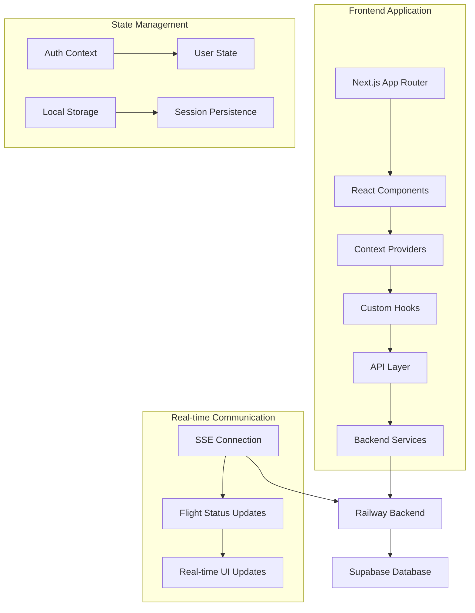

## Component Architecture

### 1. Layout & Navigation

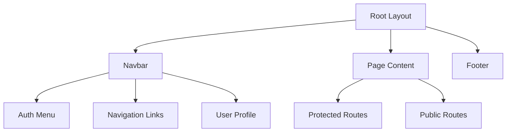

### 2. Authentication Flow

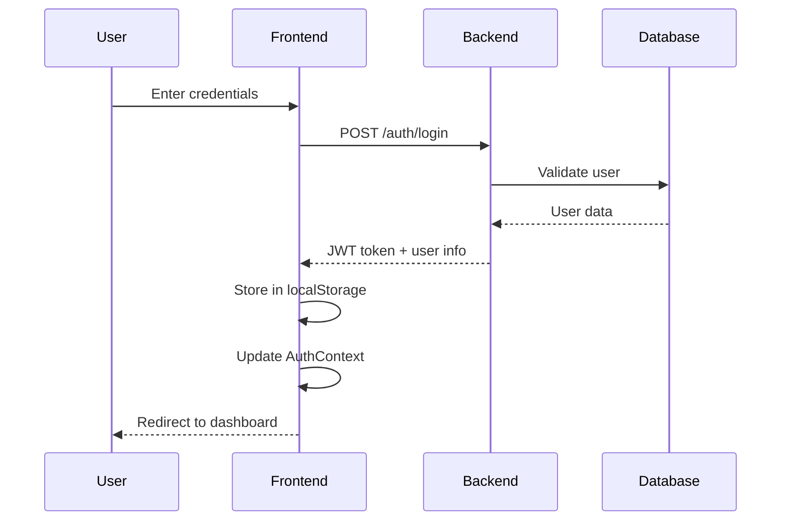

### 3. Flight Search & Booking Flow

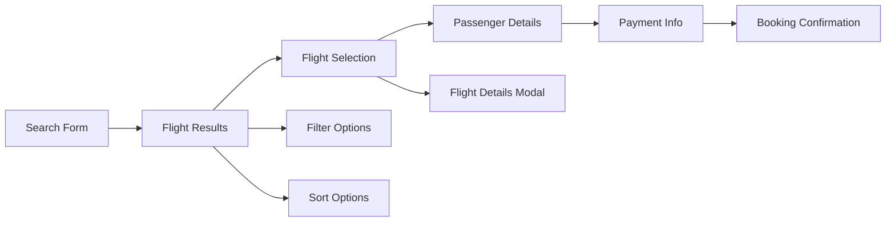

### 4. Real-time Updates Architecture

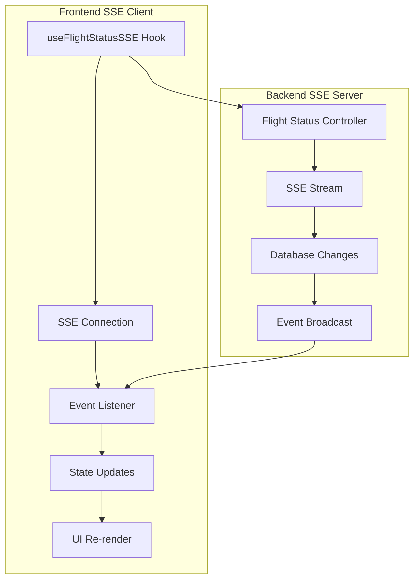

## Data Flow Architecture

### 1. Component Data Flow

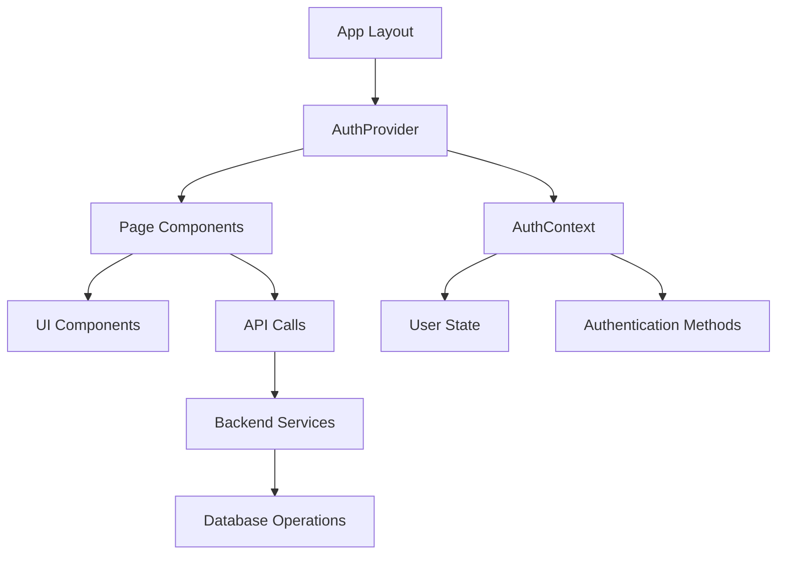

### 2. State Management Flow

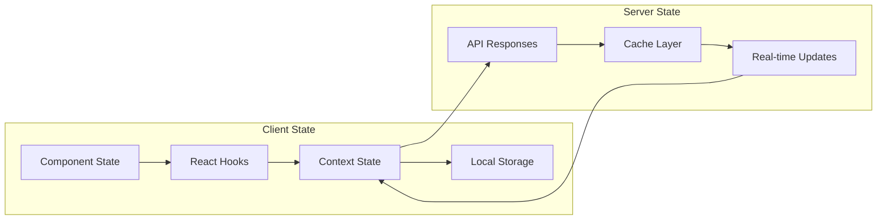

## Technology Stack Details

### Frontend Stack
- **Framework**: Next.js 15 (App Router)
- **UI Library**: React 19
- **Language**: TypeScript 5.0
- **Styling**: TailwindCSS 4.0
- **State Management**: React Context + Hooks
- **Real-time**: Server-Sent Events (SSE)

### Development Tools
- **Package Manager**: npm
- **Build Tool**: Turbopack
- **Linting**: ESLint
- **Formatting**: Prettier
- **Type Checking**: TypeScript

### Deployment
- **Platform**: Vercel
- **CI/CD**: GitHub Actions
- **Environment**: Node.js 18+

## Security Architecture

### Authentication Security
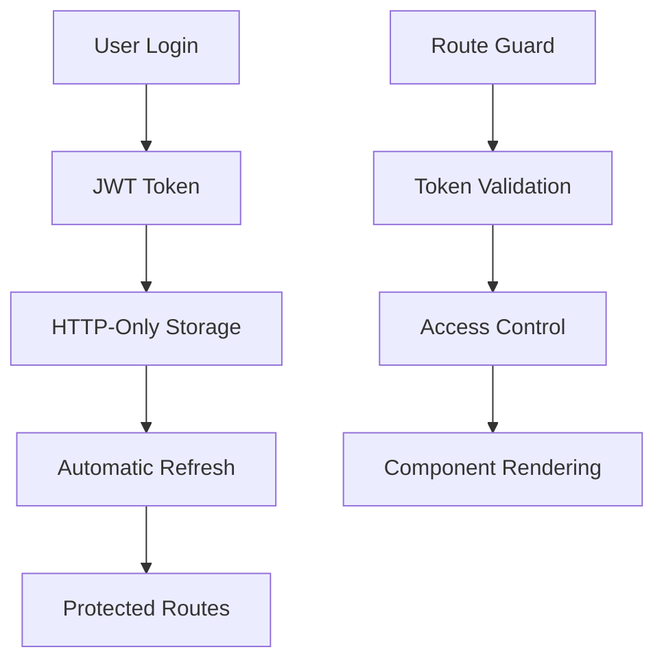

### Data Protection
- **Input Validation**: Client-side validation with TypeScript
- **XSS Prevention**: Sanitized user inputs
- **CSRF Protection**: Token-based authentication
- **Secure Communication**: HTTPS only

## Performance Architecture

### Optimization Strategies

```mermaid
graph TB
    subgraph "Build Optimizations"
        A[Code Splitting] --> B[Lazy Loading]
        B --> C[Tree Shaking]
        C --> D[Bundle Analysis]
    end
    
    subgraph "Runtime Optimizations"
        E[React.memo] --> F[useMemo/useCallback]
        F --> G[Component Memoization]
        G --> H[Virtual DOM Optimization]
    end
    
    subgraph "Network Optimizations"
        I[API Caching] --> J[Request Deduplication]
        J --> K[Compression]
        K --> L[CDN Delivery]
    end
```

### Performance Metrics
- **First Contentful Paint (FCP)**: < 1.5s
- **Largest Contentful Paint (LCP)**: < 2.5s
- **First Input Delay (FID)**: < 100ms
- **Cumulative Layout Shift (CLS)**: < 0.1

## API Integration Architecture

### REST API Integration
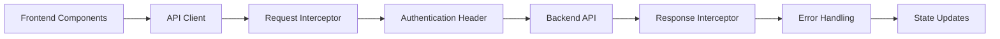

### Real-time Communication
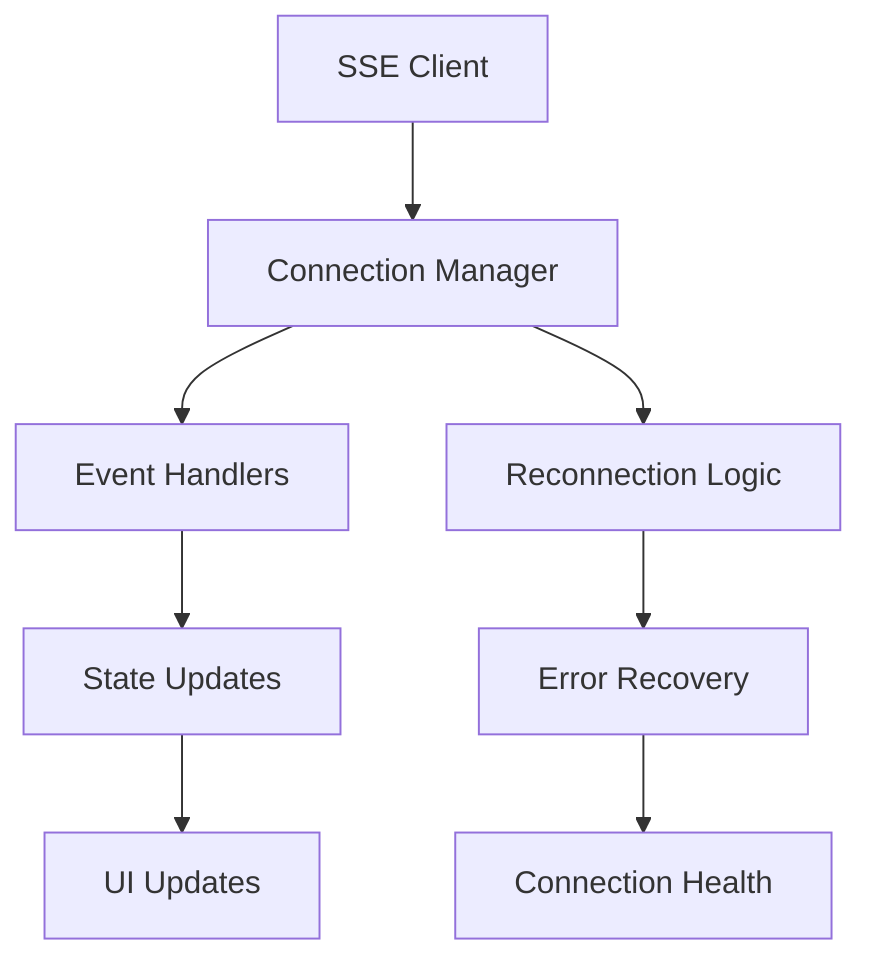

## Error Handling Architecture

### Error Flow
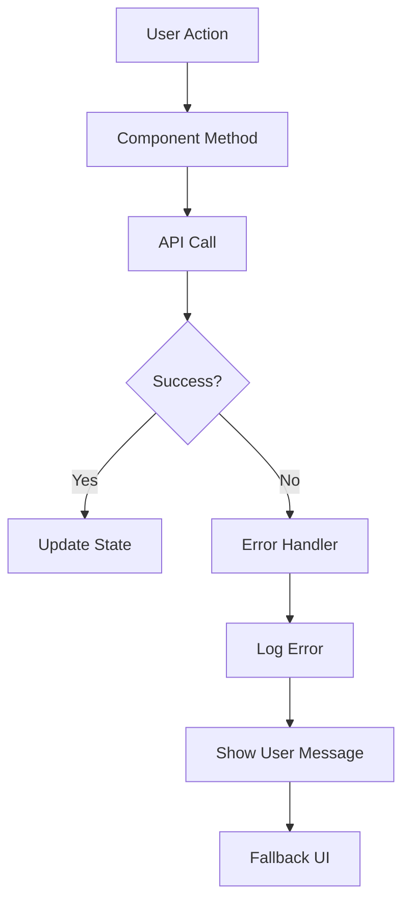

### Error Types
- **Network Errors**: Connection failures, timeouts
- **API Errors**: 4xx, 5xx HTTP status codes
- **Validation Errors**: Form validation failures
- **Authentication Errors**: Token expiration, unauthorized access

## Scalability Considerations

### Horizontal Scaling
- **CDN Distribution**: Global content delivery
- **Load Balancing**: Multiple server instances
- **Caching Strategy**: Multi-level caching
- **Database Optimization**: Connection pooling

### Vertical Scaling
- **Bundle Optimization**: Reduced bundle size
- **Memory Management**: Efficient state management
- **CPU Optimization**: Optimized algorithms
- **Network Optimization**: Reduced API calls

## Monitoring & Analytics

### Performance Monitoring
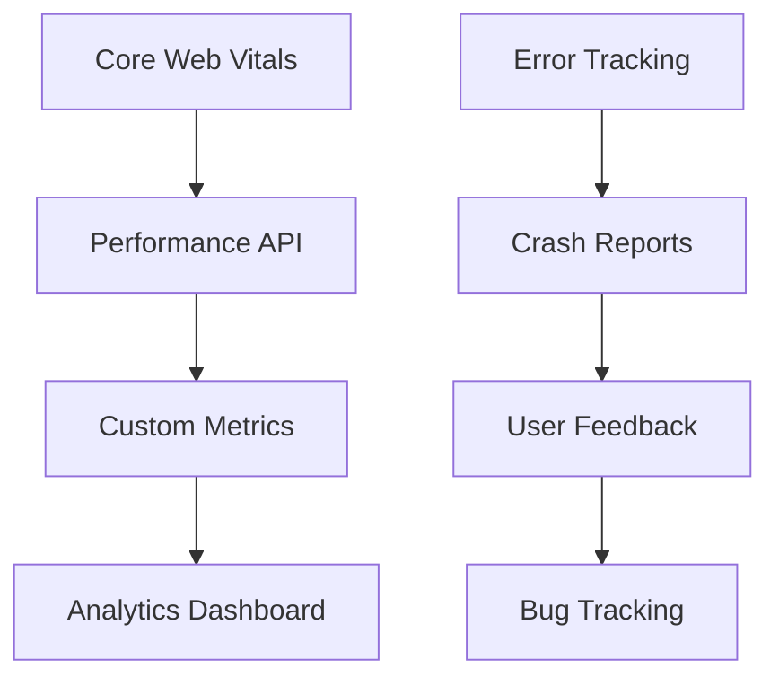

### Key Metrics
- **Page Load Time**: Average page load performance
- **User Engagement**: Session duration and interactions
- **Error Rate**: Application error frequency
- **Conversion Rate**: Booking completion rate

## Development Workflow

### Git Flow
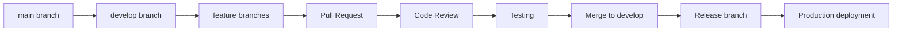

### CI/CD Pipeline
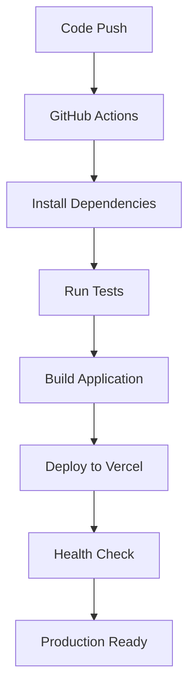

## Future Enhancements

### Planned Features
- **Progressive Web App (PWA)**: Offline functionality
- **Mobile App**: React Native version
- **Advanced Analytics**: User behavior tracking
- **Internationalization**: Multi-language support
- **Advanced Caching**: Redis integration
- **Microservices**: Service-oriented architecture

### Technical Improvements
- **Server-Side Rendering (SSR)**: Improved SEO
- **Static Site Generation (SSG)**: Better performance
- **Edge Computing**: Reduced latency
- **GraphQL**: Efficient data fetching
- **WebSockets**: Enhanced real-time features
