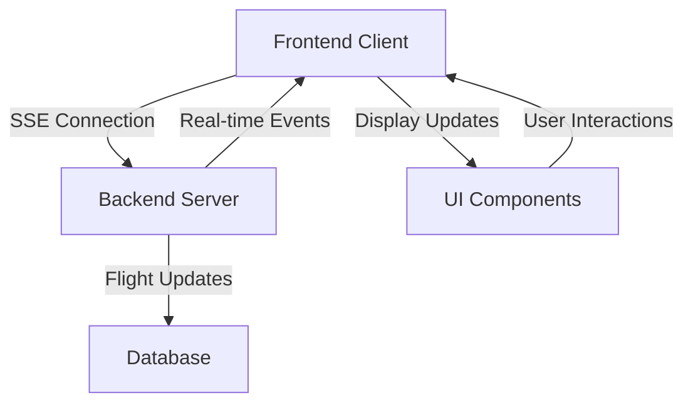

# ✈️ Flight Booking System - Frontend

A modern, responsive flight booking application built with **Next.js 15**, **React 19**, and **TypeScript**. This frontend provides a complete user interface for searching flights, booking tickets, managing reservations, and real-time flight status updates.


## 🚀 Quick Start

### Prerequisites
- Node.js 18+ 
- npm or yarn
- Running backend server ([Backend Repository](../flight-booking-system-backend))

### Installation

```bash
# Clone the repository
git clone https://github.com/yourusername/flight-booking-system-frontend.git
cd flight-booking-system-frontend

# Install dependencies
npm install

# Set up environment variables
cp .env.example .env.local

# Start development server
npm run dev
```

Open [http://localhost:3000](http://localhost:3000) to view the application.

### Environment Variables

Create a `.env.local` file in the root directory:

```env
NEXT_PUBLIC_API_URL=http://localhost:3000/api
NEXT_PUBLIC_BACKEND_URL=https://your-backend-url.railway.app
```

## 📱 Features

### 🔐 Authentication & User Management
- **User Registration** - New user account creation
- **Login/Logout** - Secure JWT-based authentication
- **Profile Management** - User preferences and settings
- **Protected Routes** - Route-level access control

### ✈️ Flight Operations
- **Flight Search** - Advanced search with filters
- **Flight Booking** - Multi-step booking process
- **Booking Management** - View and manage reservations
- **Real-time Updates** - Live flight status via SSE

### 🎯 Real-time Features
- **Flight Status Updates** - Server-Sent Events (SSE)
- **Live Notifications** - Real-time booking confirmations
- **Dynamic Pricing** - Live fare updates

### 📊 Dashboard
- **User Dashboard** - Personalized flight information
- **Booking History** - Past and upcoming flights
- **Flight Status** - Real-time status monitoring

## 🏗️ Architecture

### Project Structure

```
src/
├── app/                    # Next.js App Router
│   ├── (auth)/            # Authentication pages
│   │   ├── login/
│   │   └── register/
│   ├── book/              # Flight booking flow
│   ├── bookings/          # Booking management
│   ├── dashboard/         # User dashboard
│   ├── flight-status/     # Real-time flight status
│   ├── flights/           # Flight search and details
│   ├── profile/           # User profile management
│   ├── layout.tsx         # Root layout
│   └── page.tsx           # Home page
├── components/            # Reusable UI components
│   ├── Navbar.tsx         # Navigation component
│   ├── ProtectedRoute.tsx # Route protection
│   └── RealTimeFlightStatus.tsx # SSE component
├── contexts/              # React contexts
│   └── AuthContext.tsx    # Authentication context
├── hooks/                 # Custom React hooks
│   ├── useAuth.ts         # Authentication hook
│   ├── useFlightStatusSSE.ts # SSE hooks
│   └── useAllFlightStatusSSE.ts
├── lib/                   # Utility libraries
│   ├── auth.ts           # Authentication utilities
│   ├── api.ts            # API client
│   └── utils.ts          # General utilities
└── types/                 # TypeScript type definitions
    └── index.ts          # Application types
```

### 🔧 Technical Stack

#### Frontend Framework
- **Next.js 15** - React framework with App Router
- **React 19** - Latest React with concurrent features
- **TypeScript** - Type-safe JavaScript

#### Styling & UI
- **TailwindCSS 4** - Utility-first CSS framework
- **CSS Modules** - Scoped styling
- **Responsive Design** - Mobile-first approach

#### State Management
- **React Context** - Global state management
- **Custom Hooks** - Reusable state logic
- **Local Storage** - Client-side persistence

#### Real-time Communication
- **Server-Sent Events (SSE)** - Real-time updates
- **Custom SSE Hooks** - Reusable SSE logic
- **Auto-reconnection** - Resilient connections

#### Data Fetching
- **Fetch API** - Modern HTTP client
- **Custom API Layer** - Centralized API calls
- **Error Handling** - Comprehensive error management

## 🔌 API Integration

### Backend Integration

The frontend integrates with the NestJS backend through REST APIs and SSE:

```typescript
// API Configuration
const API_BASE_URL = process.env.NEXT_PUBLIC_BACKEND_URL;

// Authentication
POST /auth/login
POST /auth/register
GET /auth/profile

// Flight Operations
GET /flights/search
GET /flights/:id
POST /bookings
GET /bookings
GET /bookings/:id

// Real-time Updates
GET /flight-status/updates (SSE)
GET /flight-status/updates/:flightId (SSE)
```

### Real-time Updates Architecture



## 🎨 User Interface

### Page Structure

#### 🏠 Home Page (`/`)
- Hero section with flight search
- Featured destinations
- Quick booking options

#### 🔍 Flight Search (`/flights`)
- Advanced search filters
- Flight results with sorting
- Interactive flight cards

#### 📅 Booking Flow (`/book`)
- Multi-step booking process
- Passenger information forms
- Payment integration
- Booking confirmation

#### 📊 Dashboard (`/dashboard`)
- Personalized flight information
- Upcoming bookings
- Flight status overview
- Quick actions

#### 📱 Real-time Status (`/flight-status`)
- Live flight tracking
- Status updates via SSE
- Interactive flight map
- Alert notifications

### 🎨 Design System

#### Color Palette
- **Primary**: Blue (#1E40AF)
- **Secondary**: Sky Blue (#0EA5E9)
- **Success**: Green (#10B981)
- **Warning**: Amber (#F59E0B)
- **Error**: Red (#EF4444)

#### Typography
- **Headings**: Geist Sans
- **Body**: Geist Sans
- **Monospace**: Geist Mono

#### Components
- **Buttons**: Consistent styling with hover states
- **Cards**: Elevated design with shadows
- **Forms**: Validation and error states
- **Navigation**: Responsive with mobile menu

## 🛠️ Development

### Available Scripts

```bash
# Development
npm run dev          # Start development server with Turbopack
npm run build        # Build for production
npm run start        # Start production server
npm run lint         # Run ESLint

# Type Checking
npm run type-check   # Check TypeScript types
```

### Development Workflow

1. **Feature Development**
   ```bash
   # Create feature branch
   git checkout -b feature/new-feature
   
   # Make changes
   npm run dev
   
   # Test changes
   npm run build
   npm run lint
   ```

2. **Code Quality**
   - TypeScript strict mode enabled
   - ESLint with Next.js rules
   - Prettier for code formatting
   - Pre-commit hooks

3. **Testing Strategy**
   - Component testing with Jest
   - E2E testing with Playwright
   - API integration testing

## 🔐 Security Features

### Authentication
- **JWT Tokens** - Secure authentication
- **Token Refresh** - Automatic token renewal
- **Route Protection** - Protected route components
- **Session Management** - Secure session handling

### Data Protection
- **Input Validation** - Client-side validation
- **XSS Prevention** - Sanitized user inputs
- **HTTPS Only** - Secure communication
- **Environment Variables** - Secure configuration

## 🚀 Deployment

### Vercel Deployment (Recommended)

```bash
# Install Vercel CLI
npm install -g vercel

# Deploy
vercel --prod
```

### Manual Deployment

```bash
# Build the application
npm run build

# Start production server
npm start
```

### Environment Variables for Production

```env
NEXT_PUBLIC_API_URL=https://your-api-domain.com
NEXT_PUBLIC_BACKEND_URL=https://your-backend-url.railway.app
NODE_ENV=production
```

## 📊 Performance Optimizations

### Next.js Features
- **App Router** - Improved routing and layouts
- **Server Components** - Reduced client-side JavaScript
- **Image Optimization** - Automatic image optimization
- **Code Splitting** - Automatic code splitting

### Custom Optimizations
- **Lazy Loading** - Component-level lazy loading
- **Memoization** - React.memo and useMemo
- **Bundle Analysis** - Bundle size monitoring
- **Core Web Vitals** - Performance metrics tracking

## 🔧 Configuration

### Next.js Configuration (`next.config.ts`)

```typescript
const nextConfig = {
  experimental: {
    turbo: {
      resolveAlias: {
        'canvas': './empty-module.js',
      },
    },
  },
  images: {
    domains: ['your-image-domain.com'],
  },
};
```

### TypeScript Configuration (`tsconfig.json`)

```json
{
  "compilerOptions": {
    "target": "ES2017",
    "lib": ["dom", "dom.iterable", "ES6"],
    "allowJs": true,
    "skipLibCheck": true,
    "strict": true,
    "noEmit": true,
    "esModuleInterop": true,
    "module": "esnext",
    "moduleResolution": "bundler",
    "resolveJsonModule": true,
    "isolatedModules": true,
    "jsx": "preserve",
    "incremental": true,
    "plugins": [
      {
        "name": "next"
      }
    ],
    "paths": {
      "@/*": ["./src/*"]
    }
  }
}
```

## 🧪 Testing

### Test Structure
```
__tests__/
├── components/           # Component tests
├── pages/               # Page tests
├── utils/               # Utility tests
└── integration/         # Integration tests
```

### Testing Commands
```bash
# Run all tests
npm run test

# Run tests in watch mode
npm run test:watch

# Run E2E tests
npm run test:e2e
```

## 📖 API Documentation

### Authentication API

#### Login
```typescript
POST /auth/login
Content-Type: application/json

{
  "email": "user@example.com",
  "password": "password123"
}
```

#### Register
```typescript
POST /auth/register
Content-Type: application/json

{
  "email": "user@example.com",
  "password": "password123",
  "firstName": "John",
  "lastName": "Doe"
}
```

### Flight API

#### Search Flights
```typescript
GET /flights/search?origin=NYC&destination=LAX&date=2024-01-01&passengers=2
```

#### Book Flight
```typescript
POST /bookings
Content-Type: application/json
Authorization: Bearer <token>

{
  "flightId": "flight-123",
  "passengers": [
    {
      "fullName": "John Doe",
      "dob": "1990-01-01",
      "nationality": "US",
      "passportNumber": "123456789",
      "type": "ADULT"
    }
  ],
  "cabinClass": "ECONOMY"
}
```

## 🤝 Contributing

### Development Setup

1. **Fork the repository**
2. **Clone your fork**
   ```bash
   git clone https://github.com/yourusername/flight-booking-system-frontend.git
   ```
3. **Install dependencies**
   ```bash
   npm install
   ```
4. **Create a feature branch**
   ```bash
   git checkout -b feature/amazing-feature
   ```
5. **Make your changes**
6. **Commit your changes**
   ```bash
   git commit -m 'Add amazing feature'
   ```
7. **Push to the branch**
   ```bash
   git push origin feature/amazing-feature
   ```
8. **Open a Pull Request**

### Code Style Guidelines

- Use TypeScript for all new code
- Follow ESLint configuration
- Use Prettier for code formatting
- Write descriptive commit messages
- Add JSDoc comments for complex functions

## 📚 Additional Resources

### Documentation
- [Next.js Documentation](https://nextjs.org/docs)
- [React Documentation](https://react.dev/)
- [TypeScript Documentation](https://www.typescriptlang.org/docs/)
- [TailwindCSS Documentation](https://tailwindcss.com/docs)

### Related Projects
- [Backend Repository](../flight-booking-system-backend)
- [API Documentation](https://your-backend-url.railway.app/api)
- [Design System](https://your-design-system.com)

## 📞 Support

For support, email support@flightbooking.com or join our Discord community.

## 📄 License

This project is licensed under the MIT License - see the [LICENSE](LICENSE) file for details.

---

## 🔗 Links

- **Live Demo**: [https://flight-booking-frontend.vercel.app](https://flight-booking-frontend.vercel.app)
- **Backend API**: [https://flight-booking-backend.railway.app](https://flight-booking-backend.railway.app)
- **API Documentation**: [https://flight-booking-backend.railway.app/api](https://flight-booking-backend.railway.app/api)

---

Built with ❤️ by the Flight Booking Team
